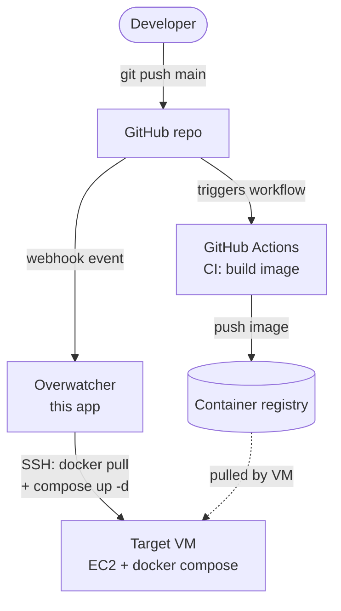

# High-Level Design

Overwatcher sits between GitHub and a target VM and automates the CD half of the pipeline. CI remains on GitHub Actions.

## Flow

1. **Push** — a developer pushes to `main` on the target repo.
2. **CI (GitHub Actions)** — the repo's existing workflow builds a Docker image and publishes it to a container registry (e.g. GHCR). This half is unchanged and not owned by Overwatcher.
3. **Webhook** — GitHub delivers a webhook event to Overwatcher. Overwatcher verifies the signature and decides whether the event should trigger a deployment.
4. **CD (Overwatcher)** — Overwatcher opens an SSH session to the target VM, runs `docker pull` for the new image, then `docker compose up -d` to roll over the affected services.
5. **Status** — Overwatcher reports deployment status back to GitHub (via the Deployments API) so the result is visible on the commit/PR.

## Scope

- **In scope:** receiving GitHub events, deciding when to deploy, talking to the VM, reporting status.
- **Out of scope:** building images, running tests, managing secrets on the VM, provisioning the VM itself.
